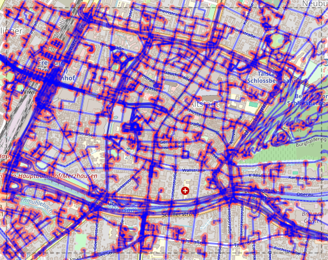
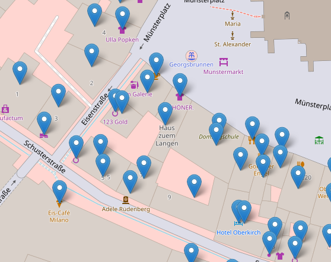

# pbf2sqlite

A simple command line tool for reading OpenStreetMap .osm.pbf files into a SQLite database.

```
Usage:
pbf2sqlite DATABASE [OPTION ...]

Main options:
  read FILE     Reads FILE (.osm.pbf or .osm) into the database
  index         Add basic indexes
  rtree         Add R*Tree indexes
  addr          Add address tables
  graph         Add graph table

Show data:
  node ID                                 Show node data
  way ID                                  Show way data
  relation ID                             Show relation data
  vaddr  LON1 LAT1 LON2 LAT2 HTMLFILE     Visualize address data
  vgraph LON1 LAT1 LON2 LAT2 HTMLFILE     Visualize graph data
  sql STATEMENT                           Execute SQL statement
```

The command
```
pbf2sqlite test.db read country.osm.pbf
```
reads the [OSM PBF](https://wiki.openstreetmap.org/wiki/PBF_Format) file **country.osm.pbf**
and creates in the database **test.db** the tables.

The tables created are described in the [documentation](doc/pbf2sqlite.md).

OSM data can be obtained from a provider such as [Geofabrik](https://download.geofabrik.de).

The **vgraph** option creates a zoomable map of the graph:  



The **vaddr** option creates a zoomable map of the addresses:  



The [SQLite](https://www.sqlite.org) and the [readosm](https://www.gaia-gis.it/fossil/readosm/index)
libraries are used for this program.

See also notes on [compilation](doc/compiling.md).

|[**Download the latest version**](https://github.com/osmzoso/pbf2sqlite/releases/latest)|
|----------------------------------------------------------------------------------------|

