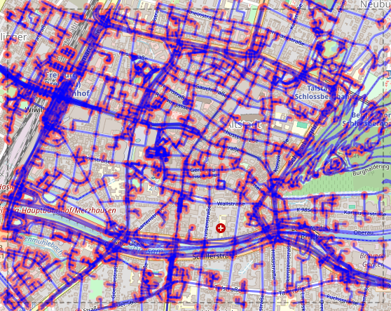
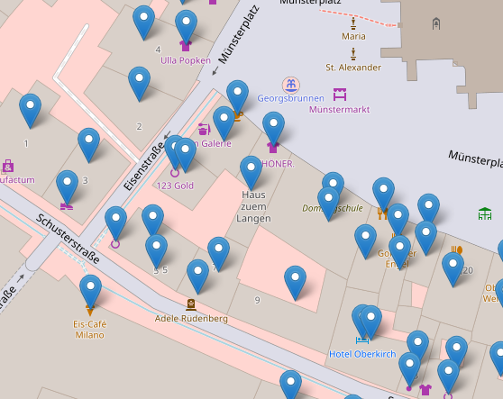

# pbf2sqlite

A simple command line tool for importing OpenStreetMap
[PBF](https://wiki.openstreetmap.org/wiki/PBF_Format)
or
[XML](https://wiki.openstreetmap.org/wiki/OSM_XML)
files into a SQLite database.

```
Usage:
pbf2sqlite <database> [OPTION ...]

Main options:
  read <file>      Reads an .osm.pbf or .osm file into the database
  index            Add basic indexes
  rtree            Add R*Tree indexes
  addr             Add address tables
  graph            Add graph tables

Additional options:
  node <id>                                           Show data of a node
  way <id>                                            Show data of a way
  relation <id>                                       Show data of a relation
  vaddr <lon1> <lat1> <lon2> <lat2> <htmlfile>        Generates a map of the addresses
  vgraph <lon1> <lat1> <lon2> <lat2> <htmlfile>       Generates a map of the graph
  sql <stmt>                                          Executes an SQL statement
  sql                                                 Executes an SQL statement from stdin
  route <lon1> <lat1> <lon2> <lat2> <permit> <file>   Calculates shortest route
                                   (<permit> can be 'foot', 'bike' or 'car')
```

The command
```
pbf2sqlite test.db read country.osm.pbf
```
reads the [OSM PBF](https://wiki.openstreetmap.org/wiki/PBF_Format) file **country.osm.pbf**
and creates in the database **test.db** the tables.

The tables created are described in the [documentation](doc/pbf2sqlite.md).

OSM data can be obtained from a provider such as [Geofabrik](https://download.geofabrik.de).

The **vgraph** option creates a zoomable map of the graph:  



The **vaddr** option creates a zoomable map of the addresses:  



The [SQLite](https://www.sqlite.org) and the [readosm](https://www.gaia-gis.it/fossil/readosm/index)
libraries are used for this program.

See also notes on [compilation](doc/compiling.md).

|[**Download the latest version**](https://github.com/osmzoso/pbf2sqlite/releases/latest)|
|----------------------------------------------------------------------------------------|

